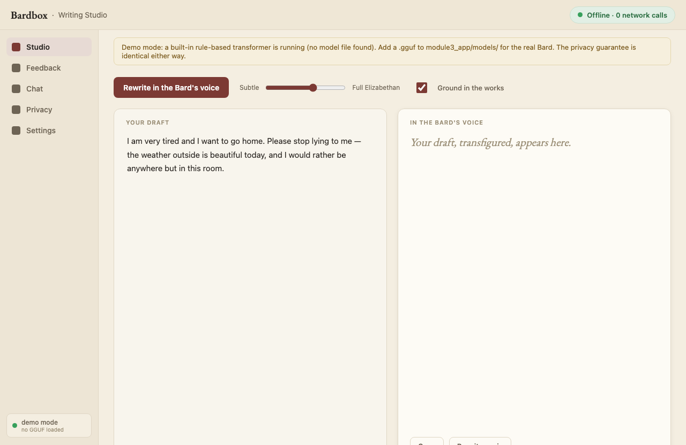
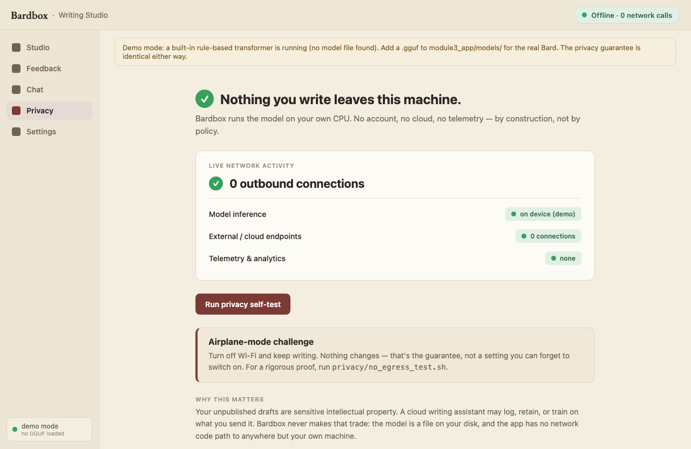

# Bardbox — a private LLM lab, in three acts

> Train a tiny language model **from scratch**, **fine-tune** a real open-source model,
> and run it **fully offline** so your data never leaves the machine — all on a
> CPU-only laptop (Intel MacBook Pro, 8 GB RAM, no GPU), all for **$0**, all on Shakespeare.

This repo is one project told as three connected modules. The same corpus — the complete
works of Shakespeare — flows through all three, so you can *see why each technique exists*:

| Act | Module | Question it answers | Where it runs |
|-----|--------|--------------------|---------------|
| I   | [`module1_from_scratch/`](module1_from_scratch/) | Do I understand how an LLM is trained? | Laptop CPU |
| II  | [`module2_finetune/`](module2_finetune/) | Can I fine-tune a real model to a task? | Free Colab/Kaggle GPU |
| III | [`module3_app/`](module3_app/) | Can I ship a model that protects user data? | Laptop CPU, offline |

The payoff is the side-by-side in [`docs/comparison.md`](docs/comparison.md): the same prompts
run through the from-scratch model, the base model, and the fine-tuned model — you can watch the
capability climb.

---

## Act I — Train from scratch (`module1_from_scratch/`)

A 0.82M-parameter decoder-only GPT, written from scratch in ~150 commented lines of PyTorch
([`model.py`](module1_from_scratch/model.py)), trained character-by-character on Shakespeare
on a plain CPU in ~37 minutes (val loss 4.23 → 1.88).

**The honest framing:** this model is *deliberately tiny and not useful*. Its output looks like
Shakespeare — line breaks, character names, archaic cadence — but it's mostly nonsense. That's
exactly the point: it demonstrates the **training mechanics** (tokenization, self-attention, the
forward/backward/step loop, a loss curve going down) without pretending a laptop can train a
useful LLM. Act II is where usefulness comes from.

```bash
cd module1_from_scratch
../.venv/bin/python data/prepare.py            # download + tokenize the corpus
../.venv/bin/python train.py --preset laptop   # train (CPU, minutes)
../.venv/bin/python plot_loss.py               # render the loss curve
../.venv/bin/python sample.py --prompt "ROMEO:"
```

See [`module1_from_scratch/report.md`](module1_from_scratch/report.md) for the loss curve and samples.

---

## Act II — Fine-tune a real model (`module2_finetune/`)

LoRA fine-tune of a small open-source instruct model (Qwen2.5-0.5B-Instruct) on a Shakespeare
style-transfer dataset. Runs on a **free** Colab/Kaggle T4 GPU (`colab_finetune.ipynb`, QLoRA
4-bit) **or with no GPU at all** on the laptop CPU (`local_finetune_cpu.py`) — the latter is how
the results below were produced. The adapter (8.8M params, 1.75% of the model) is merged and
quantized to a GGUF small enough to run on the laptop in Act III.

Real before/after from the CPU run (training loss 2.38 → 0.05):

| "The weather is beautiful today." | → |
|---|---|
| **Base Qwen:** *"There was an ambiance of delight and bliss that permeated every corner as the sun shone brightly…"* (rambles) | **Fine-tuned:** *"The heavens smile most fair upon this day."* |

The lesson (see [`module2_finetune/report.md`](module2_finetune/report.md)): the base model is
already flowery — what the fine-tune adds is **concision, faithfulness, and knowing when to stop**.

---

## Act III — Run it privately, offline (`module3_app/`)

A local "Shakespearean Writing Studio" (FastAPI + a bundled single-page frontend): rewrite your
own drafts into the Bard's voice and get in-voice feedback — with a **provable no-egress
guarantee**. The model runs on-device (in-process GGUF, or a `127.0.0.1` llama.cpp/Ollama server,
or a built-in demo transformer); a network-monitor test asserts zero outbound connections. The
privacy motivation is real: **unpublished creative writing is sensitive IP** you shouldn't have to
hand to a cloud API.



The **Privacy view** makes the guarantee demonstrable, not just asserted:



```bash
.venv/bin/python -m module3_app.backend.app     # open http://127.0.0.1:8000
./module3_app/privacy/no_egress_test.sh          # → "✓ PASS — no egress"
```

Runs on a fresh clone with **no model** (demo mode) so the app + privacy test work immediately;
drop a GGUF into `module3_app/models/` for the real Bard. See
[`module3_app/README.md`](module3_app/README.md).

---

## Setup

```bash
uv venv --python 3.11 .venv          # Intel-Mac PyTorch wheels need Python ≤3.11
uv pip install --python .venv "torch==2.2.2" "numpy<2" "matplotlib>=3.7"
```

## Why these constraints are a feature, not a bug

Old laptop, no GPU, no budget. That forces exactly the skills that matter in production: making
models **small**, running them on **CPU**, and running them **privately**. Every number in this
repo is sized so it reproduces on modest hardware for free.
