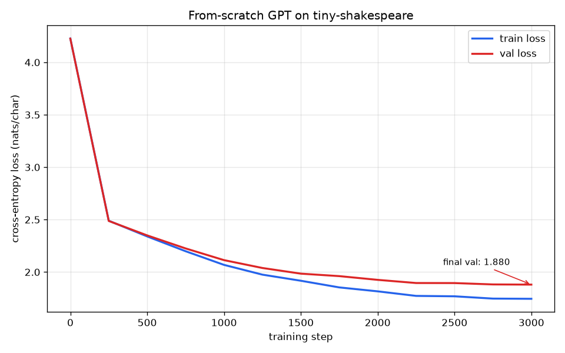

# Act I report — training a GPT from scratch

## What was built

A decoder-only transformer (the GPT/Llama family architecture) written from scratch in
[`model.py`](model.py) — token + position embeddings, causal multi-head self-attention, a stack
of pre-norm transformer blocks, weight-tied output head — and trained character-by-character on
the ~1.1 MB tiny-shakespeare corpus, entirely on an Intel laptop CPU.

- **Tokenizer:** char-level (65 symbols). The whole "vocabulary" is the sorted set of characters.
- **Model size (`laptop` preset):** 4 layers, 4 heads, 128-dim, 128-char context = **0.82M params**
  (weight-tying shares the input embedding and output head, so the count is smaller than it looks).
- **Training:** AdamW, cosine LR schedule with warmup, gradient clipping, 3000 steps, CPU only,
  **~37 minutes** on a dual-core Intel i5.

## Result: the loss curve



Cross-entropy fell from **~4.23** (random guessing over 65 chars ≈ ln 65 ≈ 4.17) to a final
**val loss of 1.88** (train 1.74). The two curves track each other until ~step 1500 and then
separate slightly (train dips below val) — the first hint of the model using its small capacity
to memorize; we stop well before that becomes real overfitting.

## Result: generated text

Sampled with `python sample.py --prompt "ROMEO:"`:

```
ROMEO:
Be bother have can mise bralies us pasteed.

QUEEN VINCENTIO:
In pecess.

RUCETIO:
And that mast bradyer the of homise an the you call.

Nurst Beseerveng Poresst under from and mother!

They peacts to reaves in prown'd. Grume, I thank conome,
And strues a from Edways you dear
But thou have shall best reciton to fallom
```

## How to read this result (the honest framing)

This output has the **shape** of Shakespeare — character names in caps followed by colons, line
breaks, `thou`/`thee`, roughly the right word lengths and rhythm — but it is **semantically
nonsense** (`bralies`, `pasteed`, `bradyer` aren't words). That is exactly what a 0.82M-parameter
character model trained for ~37 minutes on one CPU *should* produce, and saying so is the point of
Act I:

- It proves the machinery works: a from-scratch transformer + a correct training loop really does
  learn the statistics of its data (the loss curve is real learning, not memorization).
- It also proves the *limit*: usefulness — grammar, meaning, following instructions — comes from
  **scale of pretraining** that a laptop cannot reach. That is precisely why Act II doesn't train
  from scratch; it borrows a model someone pretrained at scale and cheaply specializes it.

## Reproduce

```bash
cd module1_from_scratch
../.venv/bin/python data/prepare.py
../.venv/bin/python train.py --preset laptop   # ~30 min on a dual-core CPU
../.venv/bin/python plot_loss.py
../.venv/bin/python sample.py --prompt "ROMEO:" -n 400
```
